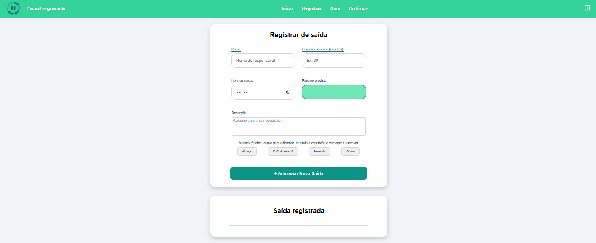
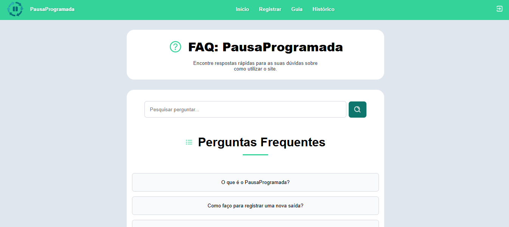
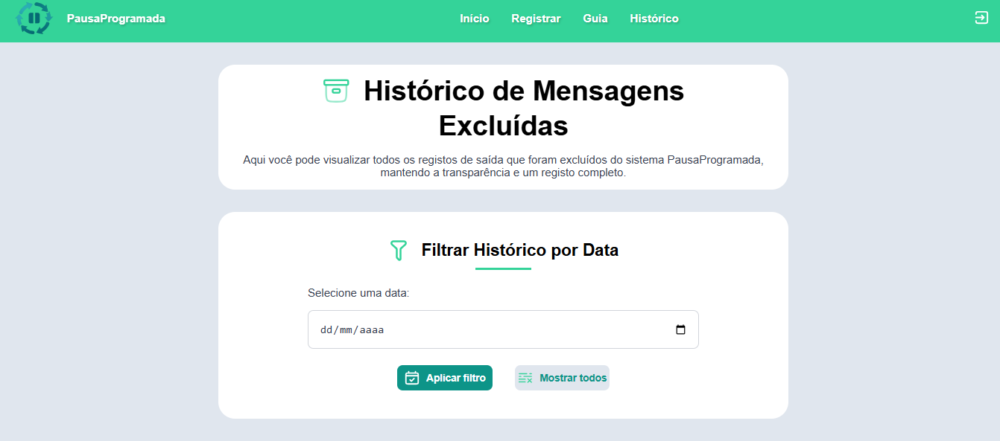

# ⏸️ Pausa Programada - Sistema de Controle de Paradas

O **Pausa Programada** é um sistema web desenvolvido para **gerenciamento de pausas e paradas em ambiente industrial**. Criado com **HTML5**, **CSS3**, **JavaScript**, **Node.js** e integração com **Firebase**, ele oferece um controle simples, confiável e acessível, permitindo que equipes de produção tenham **clareza sobre o histórico de paradas** e consigam melhorar a eficiência operacional.

---

## 🧩 Problema Real Resolvido

Na rotina de produção, é comum haver **pausas programadas e não programadas**. Muitas vezes, o controle dessas informações é feito manualmente, gerando **perda de dados, falta de rastreabilidade e dificuldades na análise de desempenho**.

O **Pausa Programada** foi desenvolvido para resolver esse gargalo, oferecendo um sistema digital de registro e consulta de pausas, garantindo que todos os apontamentos fiquem **organizados, armazenados e acessíveis em tempo real**.

---

## ⚙️ Funcionalidades

- Registro de pausas programadas e não programadas  
- Histórico detalhado de cada parada  
- Integração com **Firebase** para persistência de dados  
- Interface simples e responsiva  
- Exportação e limpeza de histórico (via `clear-history.js`)  
- Possibilidade de expansão para relatórios e métricas de eficiência  

---

## 🖼️ Telas do Sistema

### Tela de Login  
O sistema inicia com uma tela de autenticação simples, garantindo que apenas usuários autorizados possam registrar e consultar as pausas.  

  

### Tela Inicial  
Após o login, o usuário acessa a página principal, onde pode iniciar o registro das pausas programadas e não programadas.  

 

### Registro de Pausa  
Formulário intuitivo para registrar pausas, com campos para motivo, horário e observações.  

 

### Guia do site 
Guia para solucionar dúvidas que possam surgir durante o uso do site.

 

### Histórico de Pausas  
Lista com todas as pausas registradas, permitindo filtrar e excluir registros antigos.  

  

---

## 📈 Benefícios após a implementação

| Critério                           | Antes do Sistema                                   | Depois do Sistema                                |
|-----------------------------------|----------------------------------------------------|------------------------------------------------|
| Comunicação sobre produto          | Não havia clareza sobre qual produto sairia do túnel | Registro digital e compartilhado com a equipe   |
| Horário de intervalos e descidas   | Intervalos e descidas de produto sem coordenação   | Sistema informa exatamente os horários corretos |
| Controle de pausas                 | Anotações manuais e sem padrão                     | Registro padronizado e acessível                |
| Rastreamento de histórico          | Difícil localizar registros anteriores             | Histórico salvo e consultável a qualquer momento|
| Análise de eficiência              | Baseada em memória e anotações soltas              | Dados reais centralizados para análise          |

**Resultado:** o Pausa Programada trouxe **clareza, organização e comunicação eficiente** entre os turnos, reduzindo falhas e melhorando o planejamento da produção.

---

## 🛠 Tecnologias Utilizadas

| Tecnologia    | Função no Projeto                          | Badge |
|--------------|-------------------------------------------|-------|
| **HTML5**     | Estrutura das páginas                     |  |
| **CSS3**      | Estilização responsiva                    |  |
| **JavaScript**| Lógica do sistema                         |  |
| **Node.js**   | Backend e gerenciamento de pacotes        |  |
| **Firebase**  | Banco de dados e autenticação             |  |

---

## 🎨 Paleta de Cores e Tipografia

- **Fonte principal:** Inter  

### Paleta (foco no verde)

| Cor                | Código Hex | Descrição                          |
|--------------------|------------|------------------------------------|
| Branco             | #FFFFFF    | Fundo padrão                       |
| Preto              | #000000    | Texto principal                    |
| Preto acinzentado  | #1F2937    | Fundo escuro neutro                |
| Cinza claro        | #F0F4F8    | Áreas de fundo                     |
| Cinza mais claro   | #F9FAFB    | Background alternativo             |
| Azul claro         | #A5D8F3    | Destaques suaves                   |
| Azul médio         | #5DB1E5    | Links e botões secundários         |
| Azul escuro        | #2D5E89    | Títulos ou seções de destaque      |
| Verde claro        | #6EE7B7    | Destaques principais (hover, info) |
| Verde médio        | #34D399    | Cor principal do sistema           |
| Verde padrão       | #4CAF50    | Botões, confirmações               |
| Verde/Teal escuro  | #0F766E    | Ênfase em elementos importantes    |
| Laranja            | #F8A66A    | Avisos                             |
| Rosa               | #FF4D8B    | Alertas de destaque                |
| Vermelho           | #EF4444    | Erros, alertas críticos            |

---

## 📁 Estrutura de Pastas

```
pausaprogramada-project/
│── index.html          # Página principal
│── index2.html         # Página alternativa
│── index3.html         # Página auxiliar
│── clear-history.js    # Script para limpar histórico
│── package.json        # Dependências Node.js
│── serviceAccountKey.json # Configuração Firebase
│── README.md           # Documentação do projeto
│── .gitignore          # Arquivos ignorados no Git
│── .editorconfig       # Padrão de formatação
│── .gitattributes      # Configuração Git
│── /node_modules       # Dependências instaladas
└── /.git               # Repositório Git
```

---

## 👨‍💻 Autor

Desenvolvido por  
**Felipe Lopez**  

---

## 🙏 Agradecimentos

- A Deus, pela inspiração e direção.  
- À minha família, pelo apoio constante.  
- À equipe de produção, que ajudou a validar as necessidades reais e inspirou a construção deste sistema.  
